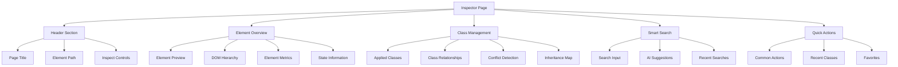
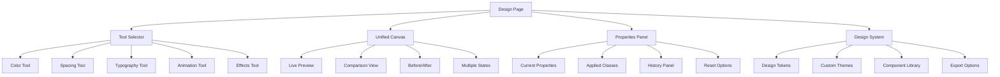
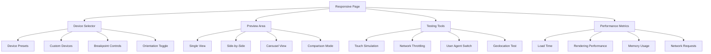
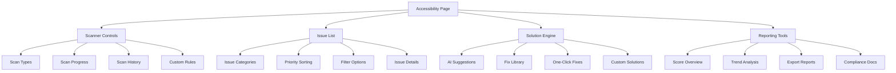

# Detailed Page Specifications

## Overview

This document provides detailed specifications for each of the four main pages in the redesigned Tailwind CSS Developer Tools extension: Inspector, Design, Responsive, and Accessibility. Each specification includes UI components, interactions, technical requirements, and implementation details.

## 1. Inspector Page Specifications

### 1.1 Page Overview
The Inspector page provides comprehensive element analysis and class management capabilities with advanced features for debugging and optimization.

### 1.2 Layout Structure



### 1.3 Component Specifications

#### ElementOverview Component
```typescript
interface ElementOverviewProps {
  elementInfo: ElementInfo;
  onElementSelect: (element: ElementInfo) => void;
  onInspectMode: () => void;
  isInspecting: boolean;
}

interface ElementInfo {
  tagName: string;
  id?: string;
  classes: string[];
  attributes: Record<string, string>;
  dimensions: {
    width: number;
    height: number;
    x: number;
    y: number;
  };
  computedStyles: ComputedStyle[];
  parent: ElementInfo | null;
  children: ElementInfo[];
  state: ElementState;
}

interface ElementState {
  hover: boolean;
  focus: boolean;
  active: boolean;
  visited: boolean;
  checked: boolean;
  disabled: boolean;
}
```

**Features:**
- Element preview with visual highlighting
- Interactive DOM hierarchy navigation
- Real-time element metrics display
- State indicators and information
- Parent/child relationship visualization

#### ClassManager Component
```typescript
interface ClassManagerProps {
  classes: AppliedClass[];
  onClassAdd: (className: string) => void;
  onClassRemove: (className: string) => void;
  onClassToggle: (className: string) => void;
  onClassEdit: (oldClass: string, newClass: string) => void;
  onGroupCreate: (classes: string[]) => void;
  searchQuery: string;
}

interface AppliedClass {
  name: string;
  source: 'direct' | 'inherited' | 'computed';
  specificity: number;
  conflicts: string[];
  variants: ResponsiveVariant[];
  state: 'active' | 'inactive' | 'conflict';
  description: string;
  preview?: string;
}

interface ResponsiveVariant {
  breakpoint: string;
  className: string;
  active: boolean;
}
```

**Features:**
- Visual class grouping and organization
- Conflict detection and resolution
- Responsive variant management
- Class relationship mapping
- Bulk operations (add, remove, group)
- Drag-and-drop reordering

#### SmartSearch Component
```typescript
interface SmartSearchProps {
  onSearch: (query: string) => void;
  onSuggestionSelect: (suggestion: ClassSuggestion) => void;
  onNaturalLanguageInput: (input: string) => void;
  placeholder: string;
  recentSearches: string[];
  aiEnabled: boolean;
}

interface ClassSuggestion {
  name: string;
  description: string;
  category: string;
  confidence: number;
  preview: string;
  alternatives: string[];
  related: string[];
}
```

**Features:**
- Natural language processing
- Pattern-based suggestions
- AI-powered recommendations
- Search history and favorites
- Real-time preview on hover

### 1.4 Interaction Patterns

#### Element Inspection
1. **Click to Inspect**: Click element on page to select
2. **Hover Preview**: Hover elements for quick preview
3. **Keyboard Navigation**: Arrow keys to navigate elements
4. **Context Menu**: Right-click for quick actions

#### Class Management
1. **Add Classes**: Search, browse, or AI-suggest classes
2. **Remove Classes**: Click remove button or use keyboard
3. **Edit Classes**: Inline editing with validation
4. **Group Classes**: Select multiple and create groups

#### Search Functionality
1. **Type Ahead**: Real-time search results
2. **Natural Language**: "Make this button larger"
3. **Pattern Matching**: Partial and fuzzy matching
4. **Category Filtering**: Filter by utility type

### 1.5 Technical Requirements

#### Performance
- <100ms response time for class operations
- <50ms search result display
- <10MB memory usage for class data
- Smooth animations (60fps)

#### Compatibility
- Chrome 88+
- Tailwind CSS v2.0+
- React 18+
- TypeScript 4.5+

#### Accessibility
- WCAG 2.1 AA compliance
- Full keyboard navigation
- Screen reader support
- High contrast mode

## 2. Design Page Specifications

### 2.1 Page Overview
The Design page provides a unified workspace for visual design tools with real-time preview and design system integration.

### 2.2 Layout Structure



### 2.3 Component Specifications

#### UnifiedDesignWorkspace Component
```typescript
interface UnifiedDesignWorkspaceProps {
  selectedTool: DesignTool;
  onToolChange: (tool: DesignTool) => void;
  elementInfo: ElementInfo;
  onPropertyChange: (property: string, value: any) => void;
  designSystem: DesignSystem;
  previewMode: 'single' | 'split' | 'compare';
}

type DesignTool = 'color' | 'spacing' | 'typography' | 'animation' | 'effects';

interface DesignSystem {
  tokens: DesignToken[];
  theme: Theme;
  customProperties: CustomProperty[];
}
```

**Features:**
- Single canvas for all design tools
- Seamless tool switching with state preservation
- Real-time preview with multiple view modes
- Design system integration
- Property locking and batch operations

#### ColorTool Component
```typescript
interface ColorToolProps {
  currentColor: string;
  onColorChange: (color: string) => void;
  colorFormat: 'hex' | 'rgb' | 'hsl' | 'tailwind';
  showPresets: boolean;
  showRecent: boolean;
  designTokens: ColorToken[];
  contrastChecker: boolean;
}

interface ColorToken {
  name: string;
  value: string;
  category: string;
  variants: ColorVariant[];
}

interface ColorVariant {
  name: string;
  value: string;
  contrast: number;
}
```

**Features:**
- Multiple color format support
- Tailwind color palette integration
- Custom color management
- Color contrast checking
- Recent colors history
- Design token integration

#### SpacingTool Component
```typescript
interface SpacingToolProps {
  spacing: SpacingValues;
  onSpacingChange: (spacing: SpacingValues) => void;
  unit: 'px' | 'rem' | 'tailwind';
  showPreview: boolean;
  presets: SpacingPreset[];
  visualMode: 'sliders' | 'input' | 'visual';
}

interface SpacingValues {
  margin: MarginValues;
  padding: PaddingValues;
  gap: number;
}

interface SpacingPreset {
  name: string;
  values: SpacingValues;
  description: string;
}
```

**Features:**
- Visual spacing editor with interactive preview
- Multiple input methods (sliders, input fields, visual)
- Preset spacing patterns
- Tailwind spacing scale integration
- Visual ruler and guide system

#### TypographyTool Component
```typescript
interface TypographyToolProps {
  typography: TypographyValues;
  onTypographyChange: (typography: TypographyValues) => void;
  webFonts: WebFont[];
  showPreview: boolean;
  textSamples: TextSample[];
}

interface TypographyValues {
  fontFamily: string;
  fontSize: string;
  fontWeight: string;
  lineHeight: string;
  letterSpacing: string;
  textAlign: string;
  textTransform: string;
}

interface WebFont {
  family: string;
  variants: FontWeight[];
  category: string;
}
```

**Features:**
- Web font integration with Google Fonts
- Real-time typography preview
- Font pairing suggestions
- Text sample library
- Responsive typography scaling

### 2.4 Interaction Patterns

#### Tool Switching
1. **Tab Navigation**: Click tabs to switch tools
2. **Keyboard Shortcuts**: Number keys for quick access
3. **State Preservation**: Tool state maintained when switching
4. **Contextual Tools**: Tools adapt to selected element

#### Property Editing
1. **Direct Manipulation**: Drag sliders, click buttons
2. **Precise Input**: Type exact values in input fields
3. **Visual Feedback**: Real-time preview of changes
4. **Batch Operations**: Apply to multiple elements

#### Design System Integration
1. **Token Application**: Click to apply design tokens
2. **Custom Creation**: Create new design tokens
3. **Theme Switching**: Switch between design themes
4. **Export Options**: Export design system

### 2.5 Technical Requirements

#### Performance
- <50ms tool switching time
- <16ms preview update (60fps)
- <5MB memory for design data
- Smooth color picker performance

#### Compatibility
- CSS Custom Properties support
- Web Font API support
- Canvas API for visual tools
- Local Storage for settings

#### Accessibility
- Color contrast compliance
- Keyboard access to all tools
- Screen reader announcements
- High contrast color support

## 3. Responsive Page Specifications

### 3.1 Page Overview
The Responsive page provides advanced responsive testing capabilities with multi-device preview, interactive testing, and performance metrics.

### 3.2 Layout Structure



### 3.3 Component Specifications

#### DevicePreviewer Component
```typescript
interface DevicePreviewerProps {
  devices: Device[];
  selectedDevice: Device;
  onDeviceChange: (device: Device) => void;
  customWidth: number;
  onCustomWidthChange: (width: number) => void;
  layout: 'single' | 'side-by-side' | 'carousel';
  zoomLevel: number;
  onZoomChange: (zoom: number) => void;
}

interface Device {
  id: string;
  name: string;
  width: number;
  height: number;
  pixelRatio: number;
  userAgent: string;
  type: 'phone' | 'tablet' | 'desktop' | 'custom';
  orientation: 'portrait' | 'landscape';
}
```

**Features:**
- Multiple device preset library
- Custom device creation and management
- Side-by-side device comparison
- Interactive device carousel
- Zoom and pan controls
- Device orientation testing

#### BreakpointDebugger Component
```typescript
interface BreakpointDebuggerProps {
  breakpoints: Breakpoint[];
  activeBreakpoint: string;
  onBreakpointChange: (breakpoint: string) => void;
  customBreakpoints: CustomBreakpoint[];
  showIndicator: boolean;
  showClasses: boolean;
}

interface Breakpoint {
  name: string;
  min: number;
  max?: number;
  class: string;
  active: boolean;
}

interface CustomBreakpoint extends Breakpoint {
  id: string;
  color: string;
  description: string;
}
```

**Features:**
- Visual breakpoint indicators
- Responsive class debugging
- Custom breakpoint creation
- Media query inspection
- Breakpoint testing tools

#### ResponsiveTestingTools Component
```typescript
interface ResponsiveTestingToolsProps {
  onNetworkChange: (speed: NetworkSpeed) => void;
  onOrientationChange: (orientation: Orientation) => void;
  onTouchSimulation: (enabled: boolean) => void;
  onUserAgentChange: (userAgent: string) => void;
  currentConditions: TestingConditions;
}

interface TestingConditions {
  networkSpeed: NetworkSpeed;
  orientation: Orientation;
  touchEnabled: boolean;
  userAgent: string;
  geolocation: GeolocationPosition;
  darkMode: boolean;
}
```

**Features:**
- Network speed simulation
- Touch gesture simulation
- User agent switching
- Geolocation testing
- Dark mode testing
- Print preview mode

### 3.4 Interaction Patterns

#### Device Selection
1. **Preset Selection**: Click device presets for quick access
2. **Custom Sizing**: Use sliders or input for custom dimensions
3. **Keyboard Shortcuts**: Number keys for common devices
4. **Search Function**: Filter devices by name or type

#### Preview Controls
1. **Zoom Controls**: Mouse wheel or buttons to zoom
2. **Pan Navigation**: Click and drag to pan preview
3. **Orientation Toggle**: Rotate device preview
4. **Fullscreen Mode**: Expand preview to full panel

#### Testing Tools
1. **Touch Simulation**: Click/tap gestures in preview
2. **Network Throttling**: Select connection speed
3. **User Agent Switch**: Choose browser simulation
4. **Responsive Testing**: Test various viewport sizes

### 3.5 Technical Requirements

#### Performance
- <100ms device switching
- <16ms preview rendering (60fps)
- <20MB memory for device data
- Smooth touch simulation

#### Compatibility
- MediaQuery API support
- Touch Events API
- Device Orientation API
- Network Information API

#### Accessibility
- Keyboard navigation for all controls
- Screen reader announcements
- High contrast mode support
- Focus management in preview

## 4. Accessibility Page Specifications

### 4.1 Page Overview
The Accessibility page provides comprehensive accessibility testing with AI-powered suggestions, automated fixes, and detailed reporting capabilities.

### 4.2 Layout Structure



### 4.3 Component Specifications

#### IssueScanner Component
```typescript
interface IssueScannerProps {
  onScanStart: (type: ScanType) => void;
  onScanComplete: (issues: AccessibilityIssue[]) => void;
  isScanning: boolean;
  scanProgress: number;
  scanType: ScanType;
  customRules: CustomRule[];
}

type ScanType = 'quick' | 'comprehensive' | 'custom' | 'continuous';

interface AccessibilityIssue {
  id: string;
  type: 'error' | 'warning' | 'info';
  category: AccessibilityCategory;
  title: string;
  description: string;
  element: HTMLElement;
  impact: 'critical' | 'serious' | 'moderate' | 'minor';
  wcagLevel: 'A' | 'AA' | 'AAA';
  fixes: AccessibilityFix[];
  automated: boolean;
}
```

**Features:**
- Multiple scan types (quick, comprehensive, custom)
- Real-time scan progress tracking
- Custom rule creation and management
- Continuous monitoring mode
- WCAG 2.1 AA/AAA compliance checking

#### SolutionEngine Component
```typescript
interface SolutionEngineProps {
  issues: AccessibilityIssue[];
  onFixApply: (fix: AccessibilityFix) => void;
  onFixPreview: (fix: AccessibilityFix) => void;
  aiSuggestions: boolean;
  batchFixes: boolean;
}

interface AccessibilityFix {
  id: string;
  type: 'automatic' | 'manual' | 'suggested';
  description: string;
  classes?: string[];
  attributes?: Record<string, string>;
  impact: FixImpact;
  confidence: number;
  automated: boolean;
}
```

**Features:**
- AI-powered fix suggestions
- One-click automatic fixes
- Fix preview and validation
- Batch fix operations
- Custom solution library

#### AccessibilityReporter Component
```typescript
interface AccessibilityReporterProps {
  issues: AccessibilityIssue[];
  score: AccessibilityScore;
  onReportGenerate: (format: ReportFormat) => void;
  onHistoryView: () => void;
  trendData: TrendData[];
}

interface AccessibilityScore {
  overall: number;
  categories: Record<AccessibilityCategory, number>;
  compliance: ComplianceLevel;
  issues: {
    critical: number;
    serious: number;
    moderate: number;
    minor: number;
  };
}
```

**Features:**
- Comprehensive accessibility scoring
- WCAG compliance reporting
- Trend analysis and tracking
- Multiple export formats
- Historical comparisons

### 4.4 Interaction Patterns

#### Scanning Process
1. **Quick Scan**: One-click basic accessibility check
2. **Comprehensive Scan**: Deep analysis with all rules
3. **Custom Scan**: User-defined rule selection
4. **Continuous Monitoring**: Real-time issue detection

#### Issue Management
1. **Issue Selection**: Click to view details
2. **Priority Sorting**: Sort by impact or category
3. **Bulk Operations**: Select multiple issues
4. **Fix Application**: Apply fixes individually or in batch

#### Solution Application
1. **Preview Mode**: See fix before applying
2. **One-Click Fix**: Apply automatic fixes
3. **Manual Fix**: Get guidance for manual fixes
4. **Validation**: Verify fix effectiveness

### 4.5 Technical Requirements

#### Performance
- <5 seconds for comprehensive scan
- <1 second for quick scan
- <50ms issue filtering
- <10MB memory for issue data

#### Compatibility
- Accessibility API support
- Shadow DOM inspection
- CSS computed styles access
- ARIA attribute inspection

#### Accessibility
- Screen reader compatible interface
- Full keyboard navigation
- High contrast mode support
- Clear error messaging

## 5. Cross-Page Features

### 5.1 Shared Components

#### NotificationSystem
```typescript
interface NotificationSystemProps {
  notifications: Notification[];
  onNotificationClose: (id: string) => void;
  position: 'top-right' | 'bottom-right';
  autoClose: boolean;
}

interface Notification {
  id: string;
  type: 'success' | 'error' | 'warning' | 'info';
  title: string;
  message: string;
  duration?: number;
  actions?: NotificationAction[];
}
```

#### KeyboardShortcuts
```typescript
interface KeyboardShortcut {
  key: string;
  modifiers: ('ctrl' | 'shift' | 'alt' | 'meta')[];
  action: string;
  description: string;
  global: boolean;
}

const shortcuts: KeyboardShortcut[] = [
  { key: 'i', modifiers: ['ctrl'], action: 'inspect', description: 'Start inspection' },
  { key: 'f', modifiers: ['ctrl'], action: 'search', description: 'Focus search' },
  { key: '1', modifiers: [], action: 'tab-inspector', description: 'Switch to Inspector' },
  { key: '2', modifiers: [], action: 'tab-design', description: 'Switch to Design' },
  { key: '3', modifiers: [], action: 'tab-responsive', description: 'Switch to Responsive' },
  { key: '4', modifiers: [], action: 'tab-accessibility', description: 'Switch to Accessibility' },
];
```

### 5.2 State Management

#### Global State Structure
```typescript
interface GlobalState {
  ui: UIState;
  element: ElementState;
  settings: SettingsState;
  design: DesignState;
  responsive: ResponsiveState;
  accessibility: AccessibilityState;
}

interface UIState {
  activeTab: string;
  sidebarOpen: boolean;
  theme: 'light' | 'dark' | 'auto';
  notifications: Notification[];
  modals: Modal[];
}
```

### 5.3 Performance Optimization

#### Memoization Strategy
```typescript
// Component memoization
const MemoizedInspector = React.memo(InspectorPage, (prev, next) => {
  return prev.elementInfo === next.elementInfo &&
         prev.searchQuery === next.searchQuery;
});

// Hook memoization
const useElementInfo = () => {
  const elementInfo = useSelector(state => state.element.current);
  return useMemo(() => analyzeElement(elementInfo), [elementInfo]);
};
```

#### Virtual Scrolling
```typescript
// For large lists of classes or issues
const VirtualizedList: React.FC<VirtualizedListProps> = ({
  items,
  renderItem,
  itemHeight = 32
}) => {
  return (
    <FixedSizeList
      height={400}
      itemCount={items.length}
      itemSize={itemHeight}
      itemData={items}
    >
      {({ index, style, data }) => (
        <div style={style}>
          {renderItem(data[index], index)}
        </div>
      )}
    </FixedSizeList>
  );
};
```

## 6. Implementation Guidelines

### 6.1 Code Organization
```
src/
├── components/
│   ├── common/          # Shared components
│   ├── inspector/       # Inspector-specific components
│   ├── design/          # Design-specific components
│   ├── responsive/      # Responsive-specific components
│   └── accessibility/   # Accessibility-specific components
├── hooks/               # Custom hooks
├── utils/               # Utility functions
├── types/               # TypeScript type definitions
├── store/               # State management
└── styles/              # Styled components
```

### 6.2 Testing Strategy
- **Unit Tests**: Component logic and hooks
- **Integration Tests**: Component interactions
- **E2E Tests**: Full user workflows
- **Accessibility Tests**: Screen reader and keyboard navigation

### 6.3 Documentation Requirements
- **Component Documentation**: Props, usage examples
- **API Documentation**: Function signatures and descriptions
- **User Guide**: How-to documentation for each feature
- **Developer Guide**: Contribution guidelines

## Conclusion

These detailed specifications provide a comprehensive foundation for implementing the redesigned Tailwind CSS Developer Tools extension. Each page has been carefully designed to provide modern, powerful, and user-friendly functionality while maintaining high performance and accessibility standards.

The specifications emphasize:
- **Modern UI/UX**: Contemporary design patterns and interactions
- **Advanced Functionality**: AI-powered features and comprehensive tools
- **Performance Optimization**: Efficient rendering and resource usage
- **Accessibility Compliance**: WCAG 2.1 AA standards throughout
- **Developer Experience**: Clear documentation and maintainable code

By following these specifications, the development team can create a world-class developer tool that significantly enhances the Tailwind CSS development workflow.