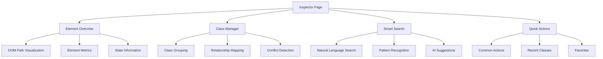
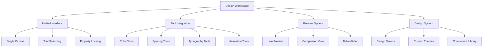
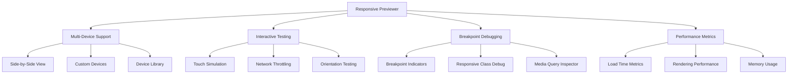
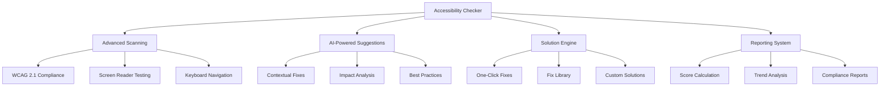

# Implementation Roadmap & Priorities

## Overview

This document outlines the implementation phases and priorities for the redesigned Tailwind CSS Developer Tools extension. The roadmap is structured to deliver value incrementally while ensuring a smooth transition from the current implementation to the new design.

## Implementation Strategy

### Guiding Principles
1. **Incremental Delivery**: Release features in phases to provide immediate value
2. **Backward Compatibility**: Maintain existing functionality during transition
3. **User Feedback**: Incorporate user testing and feedback throughout the process
4. **Performance First**: Optimize for performance at every stage
5. **Quality Assurance**: Comprehensive testing at each phase

### Risk Mitigation
- **Feature Flags**: Enable/disable new features during rollout
- **A/B Testing**: Compare old vs new implementations
- **Gradual Migration**: Phase out old components gradually
- **Rollback Plan**: Ability to revert to previous version if needed

## Phase 1: Foundation (Weeks 1-4)

### Objectives
- Establish the technical foundation for the new design system
- Implement core infrastructure and base components
- Set up development workflows and testing frameworks

### Key Deliverables

#### 1.1 Design System Implementation
- **CSS Variables**: Implement design token system
- **Base Components**: Create foundational UI components
- **Theme System**: Implement light/dark mode support
- **Typography System**: Set up type scale and font loading

#### 1.2 Component Architecture
- **Provider Components**: Implement context providers
- **Layout Components**: Create base layout components
- **Navigation Components**: Build tab navigation system
- **Utility Components**: Implement common utility components

#### 1.3 Development Infrastructure
- **Build System**: Configure build tools and bundling
- **Testing Framework**: Set up Jest, React Testing Library
- **Linting & Formatting**: Configure ESLint, Prettier
- **CI/CD Pipeline**: Set up automated testing and deployment

#### 1.4 Migration Infrastructure
- **Feature Flags**: Implement feature flag system
- **Version Management**: Set up version control and releases
- **Documentation**: Create developer documentation
- **Migration Scripts**: Build tools for data migration

### Success Criteria
- [ ] Design system fully implemented with all tokens
- [ ] Core component library created and tested
- [ ] Build pipeline configured and working
- [ ] Documentation complete and accessible
- [ ] Performance benchmarks established

### Dependencies
- Design system finalization
- Component architecture approval
- Development environment setup
- Team training on new architecture

## Phase 2: Core Features (Weeks 5-8)

### Objectives
- Implement the redesigned Inspector page
- Build the unified Design Tools workspace
- Create the enhanced Responsive Previewer
- Develop the improved Accessibility Checker

### Key Deliverables

#### 2.1 Inspector Page Redesign

**Features to Implement:**
- Advanced element analysis with computed styles
- Visual class management with relationship mapping
- Smart search with natural language processing
- Context-aware quick actions
- Class conflict detection and resolution

#### 2.2 Design Tools Unification

**Features to Implement:**
- Unified design workspace with single canvas
- Seamless tool switching with state preservation
- Real-time preview with before/after comparison
- Design system integration with custom tokens
- Batch operations for multiple elements

#### 2.3 Responsive Previewer Enhancement

**Features to Implement:**
- Side-by-side device comparison
- Interactive touch gesture simulation
- Advanced breakpoint debugging tools
- Performance metrics overlay
- Custom device creation and management

#### 2.4 Accessibility Checker Redesign

**Features to Implement:**
- Comprehensive WCAG 2.1 AA/AAA checking
- AI-powered contextual suggestions
- One-click fix application
- Accessibility scoring and reporting
- Historical tracking and trend analysis

### Success Criteria
- [ ] All four pages redesigned and functional
- [ ] Core features implemented and tested
- [ ] User acceptance testing completed
- [ ] Performance targets met
- [ ] Accessibility compliance verified

### Dependencies
- Phase 1 completion
- User testing feedback
- API integrations completed
- Content migration finished

## Phase 3: Advanced Features (Weeks 9-12)

### Objectives
- Implement AI-powered features
- Add advanced collaboration capabilities
- Build comprehensive reporting system
- Optimize performance and user experience

### Key Deliverables

#### 3.1 AI-Powered Features
- **Natural Language Processing**: Advanced class search and suggestions
- **Predictive Assistance**: Context-aware tool recommendations
- **Smart Templates**: AI-generated component templates
- **Learning Engine**: Personalized user experience

#### 3.2 Collaboration Features
- **Team Sharing**: Share configurations and templates
- **Real-time Sync**: Live collaboration on styling
- **Version Control**: Track changes and iterations
- **Comment System**: Collaborative feedback and notes

#### 3.3 Advanced Reporting
- **Detailed Analytics**: Usage patterns and insights
- **Performance Reports**: Rendering and load time metrics
- **Accessibility Reports**: Comprehensive compliance documentation
- **Export Capabilities**: Multiple format export options

#### 3.4 Performance Optimization
- **Virtual Scrolling**: Optimized large list rendering
- **Code Splitting**: Lazy loading of components
- **Memory Management**: Efficient resource usage
- **Caching Strategy**: Smart data caching

### Success Criteria
- [ ] AI features integrated and functional
- [ ] Collaboration tools working smoothly
- [ ] Reporting system comprehensive
- [ ] Performance benchmarks exceeded
- [ ] User feedback positive

### Dependencies
- Phase 2 completion
- AI service integration
- Backend API development
- User testing and feedback

## Phase 4: Polish & Refinement (Weeks 13-16)

### Objectives
- Refine user experience based on feedback
- Complete comprehensive testing
- Prepare for production release
- Document and train users

### Key Deliverables

#### 4.1 User Experience Refinement
- **Micro-interactions**: Polish animations and transitions
- **Onboarding**: User guidance and tutorials
- **Help System**: Comprehensive documentation and support
- **Error Handling**: Graceful error states and recovery

#### 4.2 Quality Assurance
- **Cross-browser Testing**: Compatibility across browsers
- **Performance Testing**: Load and stress testing
- **Security Testing**: Vulnerability assessment
- **Accessibility Testing**: Comprehensive audit

#### 4.3 Release Preparation
- **Beta Testing**: Limited user testing
- **Migration Tools**: Smooth transition from old version
- **Release Notes**: Comprehensive documentation
- **Support Plan**: Post-release support strategy

#### 4.4 Documentation & Training
- **User Documentation**: Complete user guides
- **Developer Documentation**: API and component docs
- **Video Tutorials**: Visual learning resources
- **Community Building**: User forums and support

### Success Criteria
- [ ] All testing phases completed
- [ ] Performance targets exceeded
- [ ] User satisfaction high
- [ ] Documentation complete
- [ ] Release ready

### Dependencies
- Phase 3 completion
- User feedback incorporation
- Testing completion
- Final approval

## Priority Matrix

### High Priority (Must Have)
1. **Design System Foundation** - Core to all other features
2. **Inspector Page Redesign** - Primary user workflow
3. **Component Architecture** - Technical foundation
4. **Basic Accessibility Features** - Compliance requirements

### Medium Priority (Should Have)
1. **Design Tools Unification** - Improved user experience
2. **Responsive Previewer Enhancement** - Key developer need
3. **Performance Optimization** - User satisfaction
4. **Basic Reporting** - User insights

### Low Priority (Nice to Have)
1. **AI-Powered Features** - Advanced functionality
2. **Collaboration Tools** - Team features
3. **Advanced Analytics** - Business insights
4. **Custom Themes** - Personalization

## Resource Allocation

### Team Structure
- **Frontend Developers**: 2-3 developers
- **UI/UX Designer**: 1 designer
- **QA Engineer**: 1 engineer
- **Product Manager**: 1 manager
- **DevOps Engineer**: 0.5 engineer

### Time Allocation
- **Phase 1**: 40% of total time
- **Phase 2**: 30% of total time
- **Phase 3**: 20% of total time
- **Phase 4**: 10% of total time

## Risk Assessment

### High Risk
- **Technical Complexity**: New architecture may have unforeseen challenges
- **Performance Impact**: New features may affect performance
- **User Adoption**: Users may resist changes to familiar workflows

### Medium Risk
- **Timeline Delays**: Complex features may take longer than expected
- **Resource Constraints**: Team availability may impact schedule
- **Integration Issues**: Third-party services may have compatibility issues

### Low Risk
- **Design Changes**: Minor design iterations expected
- **Documentation**: Documentation updates ongoing
- **Testing**: Standard testing procedures in place

## Success Metrics

### User Experience Metrics
- **Task Completion Rate**: >90% for core tasks
- **User Satisfaction**: >4.5/5 rating
- **Learning Curve**: <30 minutes for basic features
- **Error Rate**: <5% for common operations

### Performance Metrics
- **Load Time**: <2 seconds for initial load
- **Response Time**: <200ms for interactions
- **Memory Usage**: <100MB peak usage
- **CPU Usage**: <10% during normal operation

### Business Metrics
- **Adoption Rate**: >80% of existing users migrate
- **Feature Usage**: >60% use new features within 30 days
- **Support Tickets**: <20% reduction in support requests
- **User Retention**: >90% monthly retention rate

## Conclusion

This implementation roadmap provides a structured approach to redesigning the Tailwind CSS Developer Tools extension. By following this phased approach, we can ensure:

1. **Incremental Value Delivery**: Users benefit from improvements at each phase
2. **Risk Mitigation**: Issues are identified and addressed early
3. **Quality Assurance**: Comprehensive testing at each stage
4. **User Feedback**: Continuous improvement based on user input
5. **Performance Optimization**: Maintaining high performance standards

The roadmap balances innovation with practicality, ensuring that we deliver a modern, powerful, and user-friendly extension while maintaining the reliability and performance that users expect.

Regular reviews and adjustments to this roadmap will ensure we stay on track and respond effectively to changing requirements and user feedback throughout the implementation process.