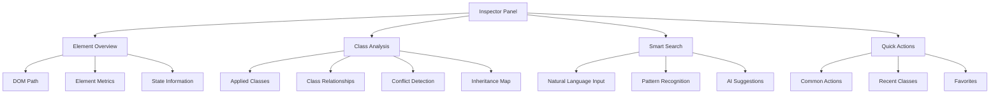
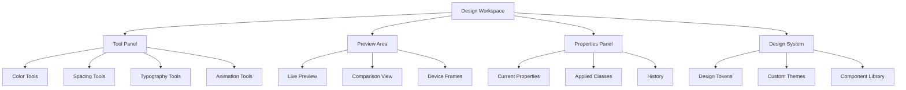
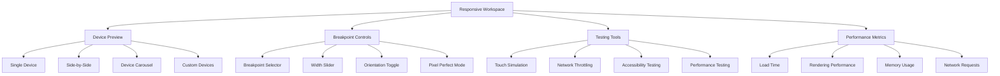
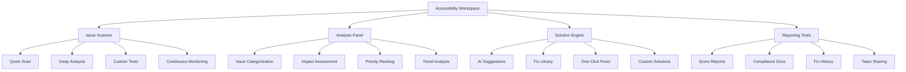

# Modern UI/UX Redesign Plan - Tailwind CSS Developer Tools

## Executive Summary

This document outlines a comprehensive redesign of the Inspector, Design, Responsive, and Accessibility pages of the Tailwind CSS Developer Tools extension. The redesign focuses on modern UI/UX patterns, enhanced functionality, and improved developer workflow integration.

## Current Implementation Analysis

### Identified Pain Points

1. **Inspector Page**
   - Limited element information display
   - No visual hierarchy of applied classes
   - Missing class relationship visualization
   - No state management for class combinations
   - Limited search and filtering capabilities

2. **Design Tools Page**
   - Separate tools create disjointed workflow
   - No preview of combined effects
   - Limited customization options
   - No design system integration
   - Missing advanced controls

3. **Responsive Previewer**
   - Limited device presets
   - No interactive testing capabilities
   - Missing breakpoint debugging tools
   - No performance metrics
   - Limited comparison features

4. **Accessibility Checker**
   - Basic issue detection only
   - No contextual suggestions
   - Limited WCAG level support
   - No reporting capabilities
   - Missing integration with design tools

## Modern UI/UX Patterns Research

### Key Design Principles

1. **Progressive Disclosure**
   - Show complexity only when needed
   - Layered information architecture
   - Contextual tool expansion

2. **Visual Hierarchy**
   - Clear information organization
   - Cognitive load management
   - Attention-driven design

3. **Workflow Integration**
   - Seamless tool transitions
   - Context-aware interfaces
   - Predictive assistance

4. **Performance-First Design**
   - Efficient rendering
   - Optimized interactions
   - Minimal resource usage

## Enhanced Page Designs

### 1. Inspector Page Redesign

#### Core Features
- **Advanced Element Analysis**
  - Complete DOM hierarchy visualization
  - Computed styles display
  - Inheritance tracking
  - Specificity calculator

- **Visual Class Management**
  - Interactive class grouping
  - Relationship mapping
  - Conflict detection
  - State variants visualization

- **Smart Search & Discovery**
  - Natural language search
  - Pattern-based suggestions
  - Context-aware recommendations
  - AI-powered alternatives

#### UI/UX Enhancements

#### Interaction Patterns
- **Hover States**: Detailed class information on hover
- **Keyboard Navigation**: Full keyboard accessibility
- **Drag & Drop**: Class reordering and grouping
- **Context Menus**: Quick actions and options

### 2. Design Tools Page Redesign

#### Unified Design Workspace
- **Integrated Tool Panel**
  - Color, spacing, and typography in one interface
  - Real-time preview of combined effects
  - Design system integration
  - Custom preset management

- **Advanced Controls**
  - Precision input fields
  - Visual sliders with snap points
  - Mathematical expressions support
  - Animation timeline editor

- **Design System Integration**
  - Custom theme import/export
  - Design token management
  - Component variant creation
  - Style guide generation

#### UI/UX Enhancements

#### Interaction Patterns
- **Unified Canvas**: Single preview area for all tools
- **Tool Switching**: Seamless transitions between tools
- **Property Locking**: Preserve values while changing tools
- **Batch Operations**: Apply changes to multiple elements

### 3. Responsive Previewer Redesign

#### Advanced Responsive Testing
- **Multi-Device Preview**
  - Side-by-side device comparison
  - Custom device creation
  - Device library management
  - Real device testing integration

- **Interactive Testing**
  - Touch gesture simulation
  - Device orientation testing
  - Network condition simulation
  - Performance metrics

- **Breakpoint Debugging**
  - Visual breakpoint indicators
  - Responsive class debugging
  - Media query inspector
  - Fluid design testing

#### UI/UX Enhancements

#### Interaction Patterns
- **Draggable Resizers**: Interactive viewport resizing
- **Device Swiping**: Natural device switching
- **Breakpoint Snapping**: Smart breakpoint detection
- **Performance Overlay**: Real-time performance metrics

### 4. Accessibility Checker Redesign

#### Comprehensive Accessibility Testing
- **Advanced Issue Detection**
  - WCAG 2.1 AA/AAA compliance checking
  - Screen reader compatibility testing
  - Keyboard navigation analysis
  - Color contrast verification

- **AI-Powered Suggestions**
  - Contextual fix recommendations
  - Alternative solution proposals
  - Impact analysis
  - Best practice guidance

- **Reporting & Documentation**
  - Accessibility score calculation
  - Detailed issue reports
  - Fix tracking and validation
  - Compliance documentation

#### UI/UX Enhancements

#### Interaction Patterns
- **Issue Highlighting**: Visual problem identification
- **Solution Preview**: Before/after comparison
- **Progressive Fixing**: Step-by-step resolution
- **Educational Content**: Learning opportunities

## Unified Design System

### Visual Design Language
- **Color Palette**: Modern, accessible color system
- **Typography**: Optimized for code and content
- **Spacing**: Consistent spatial relationships
- **Iconography**: Clear, meaningful icons
- **Animations**: Purposeful micro-interactions

### Component Library
- **Base Components**: Buttons, inputs, panels
- **Composite Components**: Forms, tables, lists
- **Layout Components**: Grids, containers, sections
- **Interactive Components**: Modals, tooltips, dropdowns

### Interaction Patterns
- **Navigation**: Consistent across all pages
- **Feedback**: Clear success/error states
- **Loading**: Progressive loading indicators
- **Transitions**: Smooth page and state transitions

## Implementation Phases

### Phase 1: Foundation (Weeks 1-4)
- Design system implementation
- Core component library
- Basic page layouts
- Navigation framework

### Phase 2: Core Features (Weeks 5-8)
- Enhanced Inspector functionality
- Unified Design Tools
- Improved Responsive Previewer
- Basic Accessibility checking

### Phase 3: Advanced Features (Weeks 9-12)
- AI-powered suggestions
- Advanced testing capabilities
- Reporting and documentation
- Performance optimizations

### Phase 4: Polish & Refinement (Weeks 13-16)
- User testing and feedback
- Performance optimization
- Accessibility improvements
- Documentation and help system

## Success Metrics

### User Experience Metrics
- Task completion time reduction
- Error rate decrease
- User satisfaction scores
- Feature adoption rates

### Performance Metrics
- Load time under 2 seconds
- Smooth animations (60fps)
- Memory usage optimization
- Responsive across all devices

### Accessibility Metrics
- WCAG 2.1 AA compliance
- Keyboard navigation coverage
- Screen reader compatibility
- High contrast mode support

## Conclusion

This comprehensive redesign transforms the Tailwind CSS Developer Tools extension into a modern, powerful, and user-friendly development environment. The focus on workflow integration, AI-powered features, and accessibility creates a tool that serves developers of all skill levels while maintaining high performance and usability standards.

The phased implementation approach ensures steady progress while allowing for user feedback and iterative improvements throughout the development process.